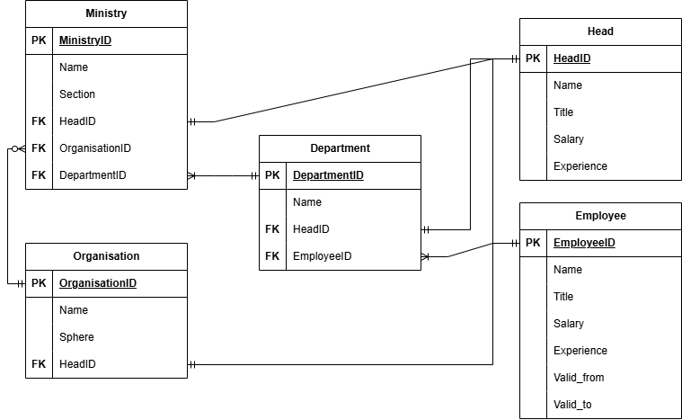
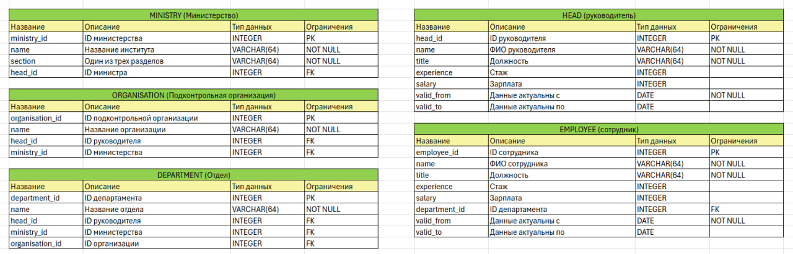

# Прототип утопического государства будущего. Проект базы данных государственной системы управления.
## Курс "Базы данных". Весна 2025. Листов Тихон. Группа Б05-322

## Общие сведения о проекте
Проект представляет собой базу данных государственной системы управления гипотетической страны будущего.\
В папке docs находится файлы концептуальной, логической и физической модели базы данных.

В папке docs также содержится выдержка из иного документа, относящегося к другому проекту, описывающая саму систему гос. институтов. Приведенная система является ориентиром и не отражает целиком реализуемую систему.

Все данные являются вымышленными, любые совпадения с реальными организациями или людьми случайны.