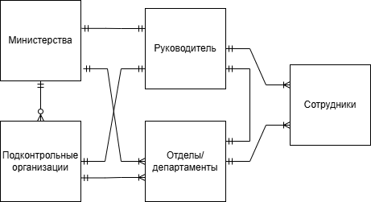
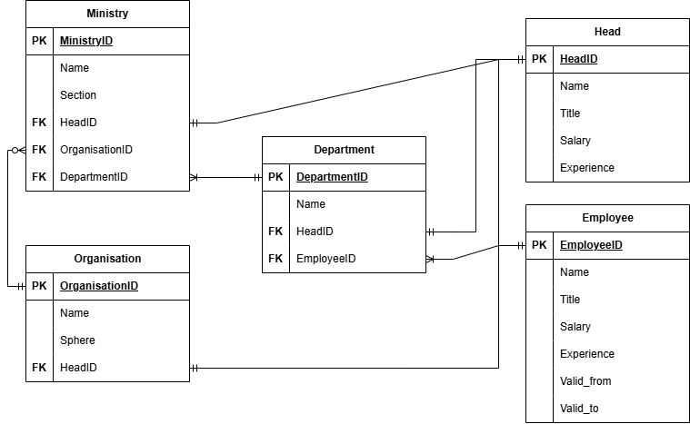

# Проект базы данных государственной системы управления.
## ФПМИ МФТИ. Курс "Базы данных". Весна 2025. Листов Тихон.

## Общие сведения о проекте
Проект представляет собой базу данных государственной системы управления гипотетической страны будущего.\
В папке docs находится файлы концептуальной, логической и физической модели базы данных.
В папке scripts хранятся PostgreSQL-скрипты для взаимодействия с базой данных, включая пробный набор данных.

В папке docs также содержится выдержка из иного документа, относящегося к другому проекту, описывающая саму систему гос. институтов. Приведенная система является ориентиром и не отражает целиком реализуемый проект.

Внимание. Большинство данных сгенерированы с помощью искусственного интелекта и программ-рандомайзеров. Совпадения с реальными персонажами или организациями случайны.
